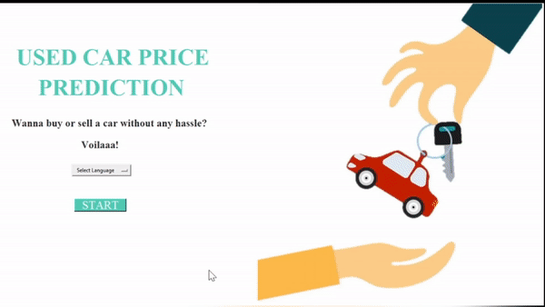
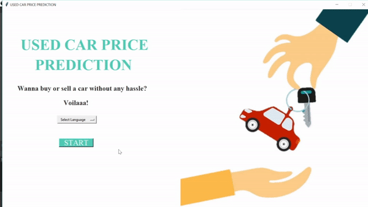
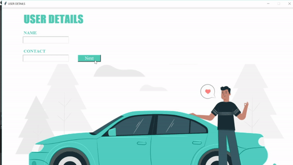
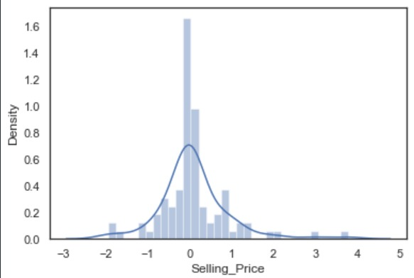
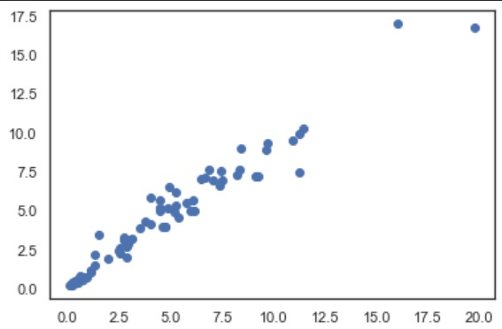

# Used-Car-Price-Prediction

## Introduction
Due to the increased price of new cars and the incapability of customers to buy new cars due to the lack of funds, used cars sales are on a global increase.
There is a need for a used car price prediction system to effectively determine the worthiness of the car using a variety of features.

## Methodology
- `Visual Studio Code` for GUI and `Jupiter Notebook` for Machine Learning Model
- `Tkinter` Python library to make it interactive and user friendly
- Load data into `MySQL` for storage
- IBM Watson `Language Translator` API

## Overview
- Used `Random Forest Regressor`, `98%` Accuracy on Training Set and `95%` Accuracy on Test Set
- Exploratory data analysis with Pandas, Mathplotlib & Seaborn to explore the insights

## Quick Demo

## Key Features
- **Language Translator**

- **Validation**

## Data Visualisation
- **Gaussian Graph**

`sns.distplot(y_test-predictions)`

- **Scattered Plot**

`plt.scatter(y_test,predictions)`

